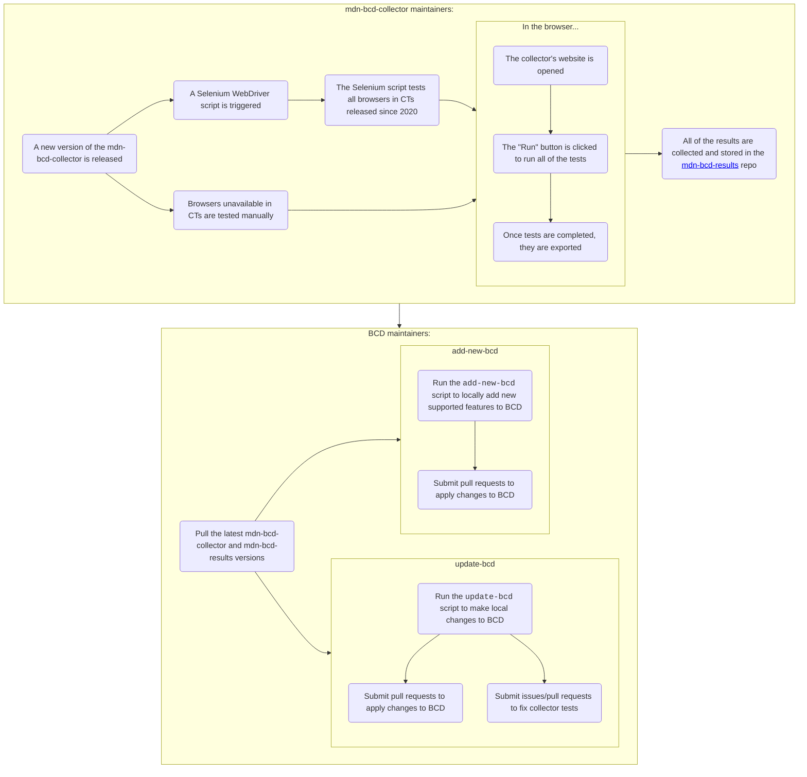

# About the mdn-bcd-collector

This project's goal is to help keep MDN's [browser-compat-data (BCD)](https://github.com/mdn/browser-compat-data) as up-to-date and as accurate as possible, by running predefined JavaScript code in browsers to determine what features are and are not supported.

Feature detection tests are generated based on machine-readable data (Web IDL, CSS definitions, etc.) from web standards, with support for custom tests and custom data where needed. Tests are then run within browsers (either manually or via a Selenium WebDriver script), generating a results file that can either be downloaded locally or submitted to the [mdn-bcd-results](https://github.com/openwebdocs/mdn-bcd-results) repository.

## Project History

This project was started by [Philip Jägenstedt](https://foolip.org/) at Google, who later contracted [Vinyl Da.i'gyu-Kazotetsu](https://www.queengoob.org) to help develop the project further. Vinyl had since forked the project and had been maintaining her own version under her own company, [Gooborg Studios](https://www.gooborg.com). The project now lives under [Open Web Docs](https://www.openwebdocs.org) ownership, with [Gooborg Studios](https://www.gooborg.com) continuing to handle the hosting.

## How to Use

The collector project has two main parts:

- The website (https://mdn-bcd-collector.gooborg.com)
  - Run a specific test on a specific browser to check if the browser supports that feature
  - Run all tests in a specific browser to determine what that browser does and does not support
  - Check to see what code was run to determine support or lack of, often during reviews of BCD PRs based on collector data
- The BCD updater scripts
  - `update-bcd` updates BCD based on results collected from the website
  - `add-new-bcd` adds data for new standard features that BCD does not yet track, also based on results collected from the website

These parts work in tandem to ultimately help ensure that BCD is as accurate as possible. Depending on what your end goal is, you may use these components together, separately, or in other ways than outlined above.

### General workflow

The workflow for the collector's process looks something like this:

(Thanks to [BrowserStack](https://www.browserstack.com/open-source), [SauceLabs](https://opensource.saucelabs.com/) and [LambdaTest](https://www.lambdatest.com/hyperexecute) for providing us with free CT resources!)

### The Website

The "website" encompasses everything involved with the web interface. This includes:

- The web server
- The web interface
- The [HTTP API](./http-api.md)

The role of the website is to act as a backend during the results collection process, serving files and test code to the browser to determine what features are and are not supported in that browser. It then receives the results from the browser so that it may be compiled into a JSON results file and either downloaded or exported to GitHub in the [mdn-bcd-results](https://github.com/openwebdocs/mdn-bcd-results) repository.

### The update scripts

The update scripts take the results collected from the website, compiles them, and then makes changes to the files in BCD to synchronize them with the collector's results. For BCD contributors, this is the primary interaction they will have with the collector. There are two scripts involved in updating BCD:

- `update-bcd` -- this updates the data for features tracked by BCD
- `add-new-bcd` -- this adds features that are not currently tracked by BCD

See [docs/update-bcd.md](./update-bcd.md) for information on how to use the `update-bcd` and `add-new-bcd` scripts.

## FAQ

### Why not generate your own version of BCD using the collected results?

The collector was designed from the ground up to help with maintaining BCD. In no way was the collector designed to compete against BCD, and for various reasons, it may never be able to:

- `@mdn/browser-compat-data` is widely used in many projects and has many contributors/reviewers
- There are a number of features that can't be tested automatically well (OS limitations, hardware requirements, etc.)
- A number of features tracked in BCD are not/cannot be tracked by the collector

### Why not use the example code from MDN?

The example code on MDN Web Docs are wonderful to demonstrate to web developers how to use a feature in their own projects. However, the examples on MDN pages are written with different goals in mind:

- MDN Web Docs examples are designed to reflect real world use cases; our code is just for feature testing
- Newer syntax (`let`/`const`, arrow functions, etc.) for modern browsers is preferred in MDN examples, as web developers should utilize them; our tests are designed to run on as old of browsers as possible
- MDN Web Docs examples don't cover every feature documented in BCD, especially behavioral features; the collector aims to provide complete coverage of BCD features

While some of our code is based on MDN Web Docs examples, it is modified to fit our needs better.

### Why not use tests from WPT.live?

[web-platform-tests (WPT)](https://wpt.fyi/) is a great resource to test support for various features. However, its purpose differs from ours:

- WPT exclusively focuses on support for standard features; BCD covers non-standard features as well
- WPT is designed to test every possible aspect of a feature to ensure it conforms to the spec, meaning it tests far more than we need to
- Newer syntax (`let`/`const`, arrow functions, etc.) for modern browsers is preferred in WPT tests; our tests are designed to run on as old of browsers as possible
- WPT's code includes lots of helper functions in various source files, and does not readily display the source code for the tests it runs; the collector test code is visible from the page, and uses minimal helper functions in the feature tests themselves (in a way, this lets the test code be used as example code)
- WPT runs tests on the latest nightly versions of browsers; BCD needs results from all of the stable releases of browsers

While some of our code is based on WPT.live tests, it is modified to fit our needs better.

## Copyright

© 2023 [Gooborg Studios](https://www.gooborg.com/) + [Open Web Docs](https://www.openwebdocs.org) + [various contributors](https://github.com/openwebdocs/mdn-bcd-collector/graphs/contributors), © 2020-2022 Google LLC, Mozilla Corporation and [Gooborg Studios](https://www.gooborg.com/).

This project is under the [Apache License 2.0](https://www.apache.org/licenses/LICENSE-2.0.html) license.
