# update-bcd Architecture Notes

The `update-bcd` script iterates through entries from a local copy of `browser-compat-data` and compares them against a set of test results from a local copy of `mdn-bcd-results` to see if there should be any updates to the `browser-compat-data` repo.

The `update-bcd` script keeps an internal representation of the data from each iterated BCD file for purposes of comparing and applying possible transformations to the data.

## Tracking the Update State of Each BCD Entry Iteration

As the script iterates through each BCD entry, an `UpdateInternal` object is created to represent the state of the data. This state object is shared across all of the script's sequential operation. The primary keys in this object are:

- `path` - the "path" of the BCD entry we're iterating through
- `shared` - a "shared" object that houses all the existing data from the local repositories, including the latest BCD data and the latest test result "support matrix".
- `debug` - a "debug" object, which builds a stack trace of any changes to the entry data.
- a set of "statement" objects that hold the existing and updated support statements for the BCD entry
  - `allStatements` - the set of existing support statements in the BCD entry
  - `defaultStatements` - a filtered set of existing "default" support statements in the BCD entry (statements without flags or browser prefixes)
  - `inferredStatements` - the set of support statements inferred from the test result "support matrix"
  - `statements` - the final set of support statements that represent the latest changes (if any) to the BCD entry

At a high level, this state object is built in three phases of operations per iteration:

1. First, we build the shared data object in the first set of `provideShared`.
2. Then, we collect the existing support statements in the following series of `provide...Statements` functions.
3. Finally, we make decisions about whether or not to update those statements in the last series of `persist...` functions.

## Data Flow Examples

Here's a step-by-step explainer with JSON snapshots of this state object to show how it's built as we move through the chain of operations in the `update` method. Refer to this diagram for a visual representation of this data flow.

```mermaid
flowchart LR
    entries((BCD Entries))
    entries --> pathFilters

    subgraph one [" "]
        pathFilters{Match Optional\nPath Filters} -- Yes -->
        provideSharedBrowserMap[[provideShared\nBrowserMap]] -->
        hasBrowserMap{Has Browser Map?} -- Yes -->
        provideSharedSupport[["provideShared\n#quot;Support#quot;"]] -->
        provideSharedUnmodifiedSupport[["provideShared\n#quot;unmodifiedSupport#quot;"]]
    end

    provideSharedUnmodifiedSupport --> iterate
    pathFilters & hasBrowserMap -- No --> entries

    subgraph two [" "]
        iterate((Iterate Browsers\nper BCD Entry)) -->
        browserFilters{Match Optional\nBrowser Filters} -- Yes -->
        provideAllStatements[[provide\nAll Statements]] -->
        provideDefaultStatements[[provide\nDefault Statements]] -->
        detectDiffs{Detect Diffs in\nSupport Matrix vs. BCD} -- Yes -->
        provideInferredStatements[[provide\nInferred Statements]] -->
        tooManyInferred{Too Many\nInferred Statements?} -- No -->
        releaseFilters{Match Optional\nRelease Filters} -- Yes -->
        defaultOrInferred{Has Default or\nInferred Statements?}
    end

    defaultOrInferred -- Yes --> persistNonDefault
    browserFilters & detectDiffs & releaseFilters & defaultOrInferred -- No --> entries
    tooManyInferred -- Yes --> entries

    subgraph three [" "]
        persistNonDefault[[persist\nNon-Default\nStatements]] -->
        tooManyDefault{Too Many\nDefault Statements?} -- No -->
        hasVersionRemoved{Has #quot;Version\nRemoved#quot; Statement?} -- No -->
        inferredStatementsOutdated{Inferred Statements Outdated?} -- No -->
        persistInferredRange[[persist\nInferred Range]] -->
        persistAddedOverPartial[[persist\nAdded Over\nPartial]] -->
        persistAdded[[persist\nAdded]] -->
        persistRemoved[[persist\nRemoved]] -->
        clearNonExact[[clearNonExact]] -->
        stillHasStatements{Still has\nstatements?}
    end

    stillHasStatements -- Yes --> saveChanges[[Save Changes]] --> entries
    stillHasStatements -- No --> entries
    tooManyDefault & hasVersionRemoved & inferredStatementsOutdated -- Yes --> entries
```



### expand("entry", ...)

Start iterating through entries in the BCD data and begin populating the state object.

```
{
  path: "api.AbortController",
  debug: {
    stack: [
      {
        step: "entry",
        result: {
          path: "api.AbortController",
        },
      },
    ],
  },
  shared: {
    bcd: {
      api: { ... },
    },
    entry: { ...api.AbortContoller entry data from bcd... },
  },
}
```

We exit early if the BCD Identifier path doesn’t match an optional `path` filter flag.

### provideShared(“browserMap”, …)

Builds the browser “Support Matrix” data from the local test results filtered by the `path` key.

```
{
  path: "api.AbortController",
  debug: {
    stack: [
      {
        step: "entry",
        result: {
          path: "api.AbortController",
        },
      },
      {
        step: "provide_shared_browserMap",
        result: {},
      },
    ],
  },
  shared: {
    bcd: { ... },
    entry: { ... },
    browserMap: Map(2) {
      chrome => Map(4),
      safari => Map(3)
    }
  },
}
```

### provideShared(“support”, …)

Get browser support data from BCD entry `__compat` data.

> [!NOTE]
> This `support` key in the `shared` object is mutated at the end of the iteration if we’ve determined that there should be updates.

```
{
  path: "api.AbortController",
  debug: { ... },
  shared: {
    bcd: { ... },
    entry: { ... },
    browserMap: Map(2),
    support: {
      chrome: {
        version_added: "80",
      },
      safari: {
        version_added: null,
      },
    },
  },
}

```

### provideShared(“unmodifiedSupport”, …)

Clones original support data. This key remains unmodified at the end of `update`.

```
{
  path: "api.AbortController",
  debug: { ... },
  shared: {
    bcd: { ... },
    entry: { ... },
    browserMap: Map(2),
    support: { ... },
    unmodifiedSupport: {
      chrome: {
        version_added: "80",
      },
      safari: {
        version_added: null,
      },
    },
  },
}
```

### expand(“browser”, …)

Start iterating through browsers in `BrowserMap` Support Matrix test results per BCD entry. Gets `versionMap` support data from the `BrowserMap` by browser key.

```
{
  path: "api.AbortController",
  debug: { ... },
  shared: {
    bcd: { ... },
    entry: { ... },
    browserMap: Map(2),
    support: { ... },
    unmodifiedSupport: { ... },
    versionMap: Map(4) {
      "82" => null,
      "83" => true,
      "84" => true,
      "85" => true
    }
  },
  browser: "chrome",
}
```

**Exit early** here if `browser` doesn’t match the optional `browser` filter flag.

### provideAllStatements

Gets all existing support statements from BCD.

```
{
  path: "api.AbortController",
  debug: { ... },
  shared: { ...},
  browser: "chrome",
  allStatements: [
    {
      version_added: "80",
    },
  ],
}
```

### provideDefaultStatements

Gets existing un-flagged and un-prefixed statements from BCD. **Exit** if no default statements found. We also run an initial comparison of the test results from the `versionMap` against the `defaultStatements` to determine if there are possible updates. If not, exit early.

```
{
  path: "api.AbortController",
  debug: { ... },
  shared: { ... },
  browser: "chrome",
  allStatements: [...],
  defaultStatements: [
  {
      version_added: "80",
    },
  ]
}
```

### provide(“inferredStatements”, …)

Infer support statements from local test results. Exits if more than 1 statement inferred or if `version_added` doesn’t match any optional `release` filters.

```
{
  path: "api.AbortController",
  debug: { ... },
  shared: { ... },
  browser: "chrome",
  allStatements: [...],
  defaulStatements: [...],
  inferredStatements: [
    {
      version_added: "≤83",
    },
  ],
}

```

### persistIfNoDefault

Updates `statements` key with inferred statements (& existing un-flagged statements) when no default statements exist.

```
{
  path: "api.AudioContext.close",
  debug: {
    stack: [
      ...,
      {
      step: "provide_statements_nonDefault",
         result: {
          statements: [
      {
        version_added: "85",
      },
    ],
    reason: {
      step: "provide_statements_nonDefault",
      message: "api.AudioContext.close applied for chrome because there is no default statement",
      skip: true,
    },
  },
}
     ]
  },
  shared: { ... },
  browser: "chrome",
  allStatements: [],
  defaultStatements: [],
  inferredStatements: [
   {
      version_added: "85",
    },
  ],
  statements: [
    {
      version_added: "85",
    },
  ]
}
```

> [!NOTE]
> Data that gets written into the `statements` key is ultimately used to mutate the original BCD data in the `shared` object when we exit the full entry loop, resulting in writes back to the BCD files.

**Exits early** if:

1. More than 1 default statement,
2. Default statement has `version_removed` data, or
3. BCD shows support for a newer browser version than there are test results for.

### persistInferredRange

Persist inferred version range when BCD version was set to `preview` or when inferred range supersedes original data.

```
{
  path: "api.AbortController.abort",
  debug: { ... },
  shared: { ... },
  browser: "chrome",
  allStatements: [ ... ],
  defaultStatements: [
    {
      version_added: "85",
    },
  ],
  inferredStatements: [
    {
      version_added: "≤84",
    },
  ],
  statements: [
    {
      version_added: "≤84",
    },
  ],
}
```

### persistAddedOverPartial

Sets `statements` support data to `false` if no inferred added data and only "partial implementation" in BCD data.

```
{
  path: "api.FakeInterface",
  debug: { ... },
  shared: { ... },
  browser: "chrome",
  allStatements: [ ... ],
  defaultStatements: [
    {
      version_added: "85",
      partial_implementation: true,
      impl_url: "http://zombo.com",
      notes: "This only works on Wednesdays",
    }
  ],
  inferredStatements: [
    {
      version_added: false,
    },
  ],
  statements: [
    {
      version_added: false,
    },
  ],
}
```

### persistAddedOver

Updates `statements` key with inferred `version_added` data under following conditions:

- it is different from existing value
- is not a range
- is not a boolean (if existing value is a string)
- existing data does not contain `partial_implementation`

```
{
  path: "api.AbortController",
  debug: { ... },
  shared: {
    ...,
    unmodifiedSupport: {
      ...,
      safari: {
        version_added: null,
      }
    },
  },
  browser: "safari",
  allStatements: [ ... ],
  defaultStatements: [ ... ],
  inferredStatements: [
    {
      version_added: "≤13.1",
       },
  ],
  statements: [
    {
      version_added: "≤13.1",
    },
  ],
}
```

### persistRemoved

Adds `version_removed` data to `statements` and optionally updates existing `version_removed` data if the inferred `version_removed` data is a string.

```
{
  path: "api.DeprecatedInterface",
  debug: { ... },
  shared: {
    ...,
    unmodifiedSupport: {
      ...,
      chrome: {
        version_added: null,
      }
    },
  },
  browser: "chrome",
  allStatements: [ ... ],
  defaultStatements: [ ... ],
  inferredStatements: [
    {
      version_added: "≤83",
      version_removed: "85",
    }
  ],
  statements: [
    {
      version_added: "≤83",
      version_removed: "85",
    },
  ],
}
```

### clearNonExact

Overwrites and clears any `statements` with ranged data if optional `exactOnly` flag is set.

There is one final skip check after this step . If there are still `statements` at this point, then we include them in the final set of changes for BCD. We also run another comparison of the `versionMap` data from the test results against the updated `defaultStatements` to see if there are still possible updates that could have been made. If there are, then we log those with a warning that possible manual intervention may be required on the BCD entry.
